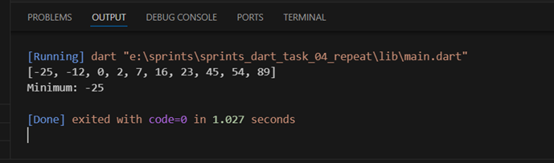

# 🔢 Minimum Number Finder


A simple Dart program that finds the minimum number in a list by sorting it in ascending order.

## 📝 Description

This program demonstrates how to find the minimum value in a list of numbers using Dart.
1. We use the sort() method to arrange the list in ascending order.
2. After sorting, the first element of the list will be the minimum value.
3. We use numbers.first to access the first element (minimum number).


## 💻 Code 

```dart
void main() {
  // origianl list
  List<int> numbers = [23, 54, 2, 89, -12, 45, 0, 7, -25, 16];
  // sort the original list in ascending order.
  numbers.sort();
  print(numbers);
  // first number of the list is the minimum :)
  print('Minimum: ${numbers.first}');
}

```
## 📋 Sample Output

 
